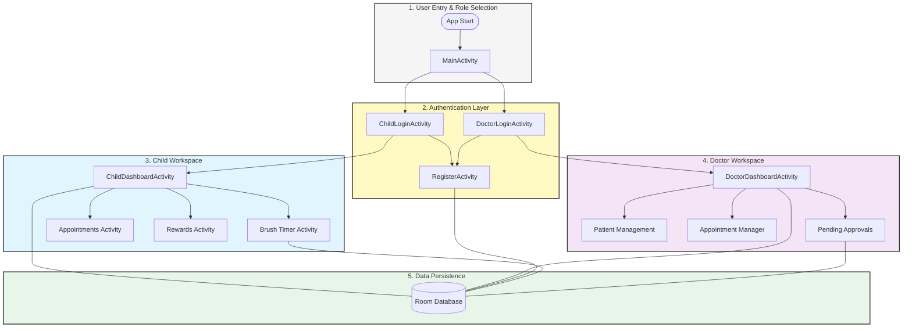

# Smile Bright App Architecture

```mermaid
flowchart TB
    %% Block 1: Entry
    subgraph Entry ["1. User Entry & Role Selection"]
        Start([App Start]) --> Main[MainActivity]
    end

    %% Block 2: Authentication
    subgraph Auth ["2. Authentication Layer"]
        Main --> ChildLogin[ChildLoginActivity]
        Main --> DocLogin[DoctorLoginActivity]
        ChildLogin & DocLogin --> Reg[RegisterActivity]
    end

    %% Block 3: Child Workspace
    subgraph ChildSpace ["3. Child Workspace"]
        direction TB
        CDash[ChildDashboardActivity]
        CDash --> Brush[Brush Timer Activity]
        CDash --> CAppt[Appointments Activity]
        CDash --> CRewards[Rewards Activity]
    end

    %% Block 4: Doctor Workspace
    subgraph DocSpace ["4. Doctor Workspace"]
        direction TB
        DDash[DoctorDashboardActivity]
        DDash --> PMan[Patient Management]
        DDash --> DAppt[Appointment Manager]
        DDash --> Appr[Pending Approvals]
    end

    %% Block 5: Data Layer
    subgraph DataLayer ["5. Data Persistence"]
        DB[(Room Database)]
    end

    %% Connections
    ChildLogin --> CDash
    DocLogin --> DDash
    CDash & DDash & Reg & Brush & Appr --- DB

    %% Styling for rectangular look
    style Entry fill:#f5f5f5,stroke:#333,stroke-width:2px
    style Auth fill:#fff9c4,stroke:#333,stroke-width:2px
    style ChildSpace fill:#e1f5fe,stroke:#333,stroke-width:2px
    style DocSpace fill:#f3e5f5,stroke:#333,stroke-width:2px
    style DataLayer fill:#e8f5e9,stroke:#333,stroke-width:2px
```
